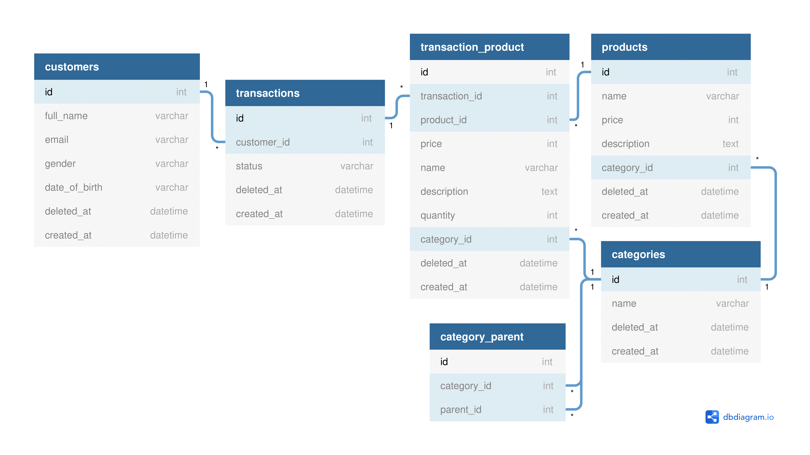

# Moutar Take Home Test

## Question 1: Basic Logic

For this test, you’ll be presented with the following question. You’ll be required to answer the question. Please answer the question (feel free to use your programming language or you can write pseudo code also)

Encryption are represented by seven different symbols:

| Symbol | Value |
|--------|-------|
| I      | 1     |
| V      | 5     |
| X      | 10    |
| L      | 50    |
| C      | 100   |
| D      | 500   |
| M      | 1000  |

For example, two is written as II in Qoala Encryption, just two added together. Twelve is Written as XII, which is simply X + II . The number twenty seven is written as XXVII, which is XX + V + II

There are six instances where substraction is used:
- I can be placed before V(5) and X(10) to make 4 and 9
- X can be placed before L(50) and C(100) to make 40 and 90
- C can be placed before D(500) and M(1000) to make 400 and 900

### Example 1

Input: “III”

Output: 3

### Example 2

Input: “IV”

Output: 4

### Example 3

Input: “IX”

Output: 9

### Example 3

Input: “LVIII”

Output: 58

Explanation

- L: 50
- V: 5
- III: 3

### Example 4

Input: “MCMXCIV”

Output: 1994

Explaination:
- M: 1000
- CM: 900
- XC: 90
- IV: 4

### Answer

See [1.cpp file](1.cpp)

## Question 2: HTML & CSS

1. Please recreate page as image (in example folder) using plain HTML5 & CSS. Recreate it as close as possible.
2. Make it mobile responsive
3. You don’t need to recreate page using same image and font-family, just use any image and font-family.

### Answer

See the [demo here](http://andraantariksa.github.io/moutar-take-home-test/2.html) or take a look on the [HTML](2.html), [CSS](assets/css/style.css), or [JavaScript](assets/js/script.js)

## Question 3: SQL

Department stores need to analyze their customer, because of that the system needs to store the customer data buying behavior. So, department stores need to collect customer data, transaction data, and also the product data.

**Answer disclaimer**

The SQL I write below are using MySQL standard with ONLY_FULL_GROUP_BY option disabled. The ONLY_FULL_GROUP_BY can be disabled by executing the command below

```
SET SESSION sql_mode=(SELECT REPLACE(@@sql_mode,'ONLY_FULL_GROUP_BY',''));
```

#### 1

Please create ERD for the flow above.

##### Answer



[Full version](3a.png)

There is a duplication of `products` table fields in `transaction_product` table. It is intended as a snapshot of the product the customer buys.

#### 2

Please create query to get best seller product for male and female.

##### Answer

Best seller product means the product that has the maximum buy quantity from all user that has the same gender. I assume there is only 2 gender in the user record, so I don't have to use `WHERE gender` predicate.

Below is the answer for such problem that handles a product that has multiple maximum buy quantity.

```sql
SELECT *
FROM products
INNER JOIN (
    SELECT customer_transaction.product_id, customer_transaction.gender, customer_transaction.total_quantity_by_gender
    FROM (
        SELECT customers.gender, customer_transaction_product_quantity.product_id, SUM(customer_transaction_product_quantity.quantity) as total_quantity_by_gender
        FROM customers
        INNER JOIN (
            SELECT transactions.customer_id, transaction_product.product_id, transaction_product.quantity
            FROM transaction_product
            INNER JOIN transactions
            ON transaction_product.order_id = transactions.id
        ) AS customer_transaction_product_quantity
        ON customer_transaction_product_quantity.customer_id = customers.id
        GROUP BY product_id, gender
    ) AS customer_transaction
    INNER JOIN (
        SELECT gender_most_buy_product.gender, MAX(gender_most_buy_product.total_quantity_by_gender) as max_quantity_buy_by_gender
        FROM (
            SELECT customers.gender, SUM(customer_transaction_product_quantity.quantity) AS total_quantity_by_gender
            FROM customers
            INNER JOIN (
                SELECT transactions.customer_id, transaction_product.product_id, transaction_product.quantity
                FROM transaction_product
                INNER JOIN transactions
                ON transaction_product.order_id = transactions.id
            ) AS customer_transaction_product_quantity
            ON customer_transaction_product_quantity.customer_id = customers.id
            GROUP BY product_id, gender
        ) AS gender_most_buy_product
        GROUP BY gender_most_buy_product.gender
    ) as gender_max_total_buy_product
    ON gender_max_total_buy_product.max_quantity_buy_by_gender = customer_transaction.total_quantity_by_gender
    AND gender_max_total_buy_product.gender = customer_transaction.gender
) AS gender_most_buy_product
ON gender_most_buy_product.product_id = products.id;
```

Example case:

| Gender | Quantity Buy by Gender | Product ID |
|--------|------------------------|------------|
| male   | 5                      | 1          |
| male   | 5                      | 2          |
| male   | 1                      | 3          |
| male   | 4                      | 4          |
| male   | 4                      | 5          |
| female | 5                      | 1          |
| female | 5                      | 2          |
| female | 1                      | 3          |
| female | 6                      | 4          |
| female | 6                      | 5          |

Result of best selling product:

| Gender | Quantity Buy by Gender | Product ID |
|--------|------------------------|------------|
| male   | 5                      | 1          |
| male   | 5                      | 2          |
| female | 6                      | 4          |
| female | 6                      | 5          |

* Other product information are removed for the sake of brevity

---

And below is the answer for such problem that does not handles a product that has multiple maximum buy quantity.

```sql
SELECT *
FROM (
    SELECT *
    FROM (
        SELECT
            customers.gender,
            SUM(customer_transaction_product_quantity.quantity) as total_quantity_by_gender,
            customer_transaction_product_quantity.product_id
        FROM customers
        INNER JOIN (
            SELECT transactions.customer_id, transaction_product.product_id, transaction_product.quantity
            FROM transaction_product
            INNER JOIN transactions
            ON transaction_product.order_id = transactions.id
        ) AS customer_transaction_product_quantity
        ON customer_transaction_product_quantity.customer_id = customers.id
        GROUP BY product_id, gender
        ORDER BY SUM(customer_transaction_product_quantity.quantity) DESC
    ) AS gender_most_buy_product
    GROUP BY gender_most_buy_product.gender
) AS gender_most_buy_product
INNER JOIN products
ON products.id = gender_most_buy_product.product_id;
```

Example case:

| Gender | Quantity Buy by Gender | Product ID |
|--------|------------------------|------------|
| male   | 5                      | 1          |
| male   | 5                      | 2          |
| male   | 1                      | 3          |
| male   | 4                      | 4          |
| male   | 4                      | 5          |
| female | 5                      | 1          |
| female | 5                      | 2          |
| female | 1                      | 3          |
| female | 6                      | 4          |
| female | 6                      | 5          |

Result of best selling product:

| Gender | Quantity Buy by Gender | Product ID |
|--------|------------------------|------------|
| male   | 5                      | 1          |
| female | 6                      | 4          |

* Other product information are removed for the sake of brevity

#### 3

Please create query to get customer that spends the most money.

##### Answer

Multiple maximum value

```sql
SELECT *
FROM customers
INNER JOIN (
    SELECT transactions.customer_id, SUM(transaction_product.price * transaction_product.quantity) as total_spent
    FROM transaction_product
    INNER JOIN transactions ON transaction_product.order_id = transactions.id
    GROUP BY transactions.customer_id
) AS customer_total_spent
ON customer_total_spent.customer_id = customers.id
WHERE customer_total_spent.total_spent = (
    SELECT SUM(transaction_product.price * transaction_product.quantity) as total_spent
    FROM transaction_product
    INNER JOIN transactions ON transaction_product.order_id = transactions.id
    GROUP BY transactions.customer_id
    ORDER BY SUM(transaction_product.price * transaction_product.quantity) DESC
    LIMIT 1
);
```

Single maximum value

```sql
SELECT *
FROM customers
INNER JOIN (
    SELECT transactions.customer_id, SUM(transaction_product.price * transaction_product.quantity) as total_spent FROM
        transaction_product INNER JOIN transactions ON transaction_product.order_id = transactions.id
    GROUP BY transactions.customer_id
    ORDER BY SUM(transaction_product.price * transaction_product.quantity) DESC
    LIMIT 1
) AS customer_total_spent
ON customer_total_spent.customer_id = customers.id;
```

#### 4

Please create query to show number of transactions for every 2 hours.

##### Answer

```sql
SELECT DATE_ADD('1970-01-01 00:00:01.000000', INTERVAL ((TIMESTAMPDIFF(HOUR, '1970-01-01 00:00:01.000000', transactions.created_at) DIV 2) * 2) HOUR) AS Timestamp, COUNT(*)
FROM transactions
GROUP BY DATE_ADD('1970-01-01 00:00:01.000000', INTERVAL ((TIMESTAMPDIFF(HOUR, '1970-01-01 00:00:01.000000', transactions.created_at) DIV 2) * 2) HOUR)
ORDER BY DATE_ADD('1970-01-01 00:00:01.000000', INTERVAL ((TIMESTAMPDIFF(HOUR, '1970-01-01 00:00:01.000000', transactions.created_at) DIV 2) * 2) HOUR);
```

###### Explanation:

The transaction can be grouped by how many hour after some time (In this case, it is Unix epoch). To group the transactions every 2 hours, I use integer division on the hour and multiplied it again (rounding to floor even number).
